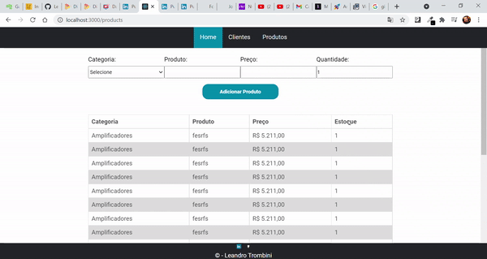

  

# Produto

Sistema criado para o desafio #2 realizado durante o programa Hiring Coders.

## Tecnologias e Recursos Utilizados
 - React
 - Javascript
 - Local Storage
 
## Funcionalidades
 O sistema armazena os dados no Local Storage do navegador. Os dados armazenados são:
 
 - Formulário de cadastro de cliente.
 - O estoque de produtos.
 
 
> Desenvolvido por Leandro Trombini
